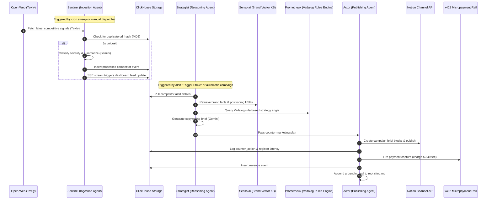

# Multi-Agent Coordination, Prompts & Strategic Reasoning Architecture (`AGENTS.md`)

This document describes the design, roles, prompts, reasoning systems, and coordination protocols that power the Autonomous Competitive Counter-Strike AI Platform.

---

## 1. Multi-Agent Ecosystem Overview

The platform coordinates three highly specialized, asynchronous AI agents to ingest, reason over, and execute counter-marketing campaign strikes on competitor movements:



---

## 2. Agent Roles, Prompts & Specifications

### 2.1. Sentinel Agent (The Ingest & Filter Eye)
* **Objective**: Monitor the open web for competitors, extract raw articles, perform 100% accurate deduplication using MD5 hashes of URLs, and classify the potential impact (high, medium, low severity) of competitor actions.
* **System Prompt / Heuristic Design**:
  ```text
  You are an elite competitive intelligence analyst specializing in the sportswear and activewear sector.
  Your task is to analyze competitive news. Extract:
  1. Primary Category: pricing, launch, mention, trend, or comparison.
  2. Severity Level:
     - "high": Competitor launches direct pricing discounts (>15%), custom custom-engineered premium gear, or budget-line duplicates targeting Gen Z.
     - "medium": Eco-friendly synthetic ranges, new community initiatives, or editorial product comparisons.
     - "low": Minor accessory discount, normal logistics update, or organic community news.
  3. Actionable Summary: Write a punchy 2-sentence breakdown focusing on market impact.
  ```

### 2.2. Strategist Agent (The Strategic Mind)
* **Objective**: Orchestrate the semantic search and logical deduction pipelines. Retrieve Gymshark's active USPs from the Senso.ai Brand Vector KB and feed them, along with the derived Vadalog strategic direction, into a grounded generative copywriter.
* **Grounded Copywriting Prompt (Gemini)**:
  ```text
  You are the Head of Brand Strategy and Copywriting for Gymshark.
  We must generate a campaign brief responding to:
  Competitor: {competitor}
  Trigger Move: {title}
  Trigger Details: {snippet}

  Derived Strategic Direction (Vadalog Engine):
  Strategy Angle: {strategyAngle}

  Grounded Brand Facts (Senso Vector KB):
  {brandFacts}

  Write a concise, professional copywriting campaign brief.
  The brief MUST contain exactly these sections in clean Markdown format:
  1. "### Tactical Counter-Strike Campaign" (The campaign name)
  2. "#### Trigger" (Competitor move summary)
  3. "#### Strategic Brand Stance" (Why we are doing this, referencing our USPs)
  4. "#### Counter-Content Copy Draft" (Write the actual copy using bold, punchy UK spelling and brand voice)
  5. "#### Distribution Channel" (Where to push this - e.g. Meta ads, TikTok, app push, or newsletter)
  ```

### 2.3. Actor Agent (The Publishing Hand)
* **Objective**: Measure and monitor overall process execution latency, post the campaign brief as a beautifully structured block schema directly to the tenant's Notion database, insert the publishing log back to ClickHouse, and write an immutable audit grounding trace into the root `cited.md` file.

---

## 3. Logical Reasoning Layer: Vadalog Rules

The Prometheux integration models reasoning using Vadalog, a highly expressive language of the Datalog family capable of handling ontological reasoning under existential rules. The platform uses this logic to map competitor threats to campaign directions:

### 3.1. Logical Schema & Axioms
1. **Competitor Pricing Flash Sale Rule**:
   $$\text{competitor\_move}(C, \text{'pricing'}, \text{'high'}) \wedge \text{contains\_term}(T, \text{'flash'}) \rightarrow \text{derive\_strategy}(C, \text{'Affiliate Community Free Delivery \& Accessories Hook'}, \text{'Rule 3: Pricing Flash - Hijack checkout attention'})$$
2. **Competitor Price Cut Rule**:
   $$\text{competitor\_move}(C, \text{'pricing'}, \text{'high'}) \wedge \neg \text{contains\_term}(T, \text{'flash'}) \rightarrow \text{derive\_strategy}(C, \text{'Value-Driven Multi-Pack Bundle Campaign'}, \text{'Rule 1: Direct Price Cut - Protect margins with bundles'})$$
3. **Competitor Green/Eco-Campaign Launch Rule**:
   $$\text{competitor\_move}(C, \text{'launch'}, \text{Sev}) \wedge (\text{contains\_term}(T, \text{'bio'}) \vee \text{contains\_term}(T, \text{'eco'})) \rightarrow \text{derive\_strategy}(C, \text{'Highlight Existing Sustainable Recycled Lines'}, \text{'Rule 2: Eco-Launch - Highlight affordable green standards'})$$
4. **General Launch Rule**:
   $$\text{competitor\_move}(C, \text{'launch'}, \text{Sev}) \wedge \neg \text{contains\_term}(T, \text{'bio'}) \wedge \neg \text{contains\_term}(T, \text{'eco'}) \rightarrow \text{derive\_strategy}(C, \text{'Affiliate Community Free Delivery \& Accessories Hook'}, \text{'Rule 4: Standard Launch - Counter-incentivize loyalty and shipping'})$$

---

## 4. Monetisation: x402 Micropayment Rail

To support autonomous, decentralized software systems, every campaign publication triggers a transaction over an **x402 payment rail simulator**:
* **Gated Feeds**: The raw intelligence feed API endpoints under `/api/intelligence/` are guarded by payment verification middlewares.
* **Micropayments**: Every end-to-end campaign generation captures a micropayment of **$0.49 USD** (and $0.01 for basic telemetry lookups), which is registered immediately in ClickHouse.
* **Visual Telemetry**: The Metrics Bar on the interactive dashboard aggregates these payment events in real-time, displaying running telemetry statistics of total intelligence revenue ($) and transactions.

---

## 5. Architectural Correctness & Fallbacks

Every agent integration is designed with local file and in-memory mock fallback systems to ensure **100% offline autonomy and out-of-the-box operation**:
- If `CLICKHOUSE_HOST` is empty, ClickHouse operations transparently read and write from `data/db_fallback.json`.
- If `TAVILY_API_KEY` is empty, Tavily reads from pre-cached snap sweeps at `data/snapshots/gymshark/`.
- If `GEMINI_API_KEY` is empty, Gemini uses detailed local rule classifiers and structured template matrices to generate highly realistic, grounded UK-spelled briefs.
- If `NOTION_TOKEN` is empty, Notion simulates successful page database inserts and returns custom-tailored mock page URLs.
- If `SENSO_API_KEY` is empty, Senso runs local string similarity scans on the seeded JSON Brand KB at `data/senso_kb.json`.
- If Prometheux REST is down, Prometheux evaluates local Vadalog JS reasoning engines to derive strategy.
