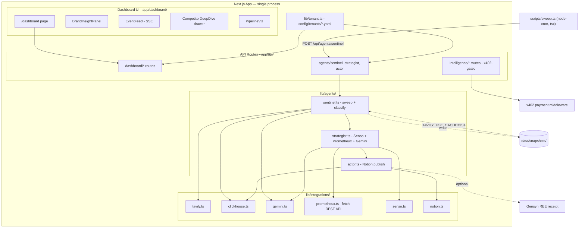

# Competitor Counter-Strike Agent — Implementation Plan

## Core Concept

A **white-label autonomous competitive intelligence platform** for real UK brands. Agents ingest **real open-web data** (competitor sites, social signals, news, pricing, content) via Tavily, reason over brand knowledge, and **publish real counter-actions** to an **owned Notion workspace** — never impersonating or modifying a brand's production site.

**Default demo tenant: Gymshark.** Swappable to any brand via config — no API keys in the UI.

**Stack: Next.js 16 (full-stack).** Agents, API routes, and dashboard all live in one Next.js app.

### Adopted enhancements

- **B** — Competitor deep-dive drawer (events list + trend chart per competitor)
- **E** — Cached Tavily snapshots for reliable live demos
- **F** — Notion as primary publish channel

---

## Sponsor Mapping (in codebase)

| Sponsor | Role in codebase |
|---------|------------------|
| **Tavily** | Primary data layer — omnisearch across competitor websites, social mentions, news, pricing pages, product launches, comparison content, market trends. Pre-configured query templates per tenant; users never touch API keys. Results cached to disk for demo fallback |
| **ClickHouse** | Event store + brand/competitor analytics |
| **Senso.ai** | Brand knowledge base (USPs, product lines, tone, competitive positioning) seeded from public brand info |
| **Prometheux** | Vadalog reasoning via REST API — competitor move → brand strength → counter-angle with lineage |
| **Google DeepMind (Gemini 2.0 Flash)** | Classification, weakness extraction, counter-content drafting |
| **Gensyn REE** *(optional, last step)* | Verifiable receipt on final published content |
| **x402** | Sole payment rail — monetised intelligence API |

### Credentials policy

All sponsor API keys live in server-side `.env` only — accessed exclusively in `lib/integrations/` and `app/api/` (never in client components). **No API key fields in the dashboard UI.** Tenant switching is config-driven (`ACTIVE_TENANT=gymshark`), not user-supplied keys.

---

## White-Label Tenant Model

Each tenant is a YAML file under `config/tenants/`:

```yaml
# config/tenants/gymshark.yaml (default)
id: gymshark
display_name: Gymshark
domain: gymshark.com
logo_url: https://...
market: UK activewear / D2C
competitors:
  - name: Lululemon
    domains: [lululemon.co.uk, lululemon.com]
  - name: Nike
    domains: [nike.com]
  - name: ASOS
    domains: [asos.com]
  - name: Adidas
    domains: [adidas.co.uk]
  - name: Under Armour
    domains: [underarmour.co.uk]
owned_publish_channel:
  type: notion
  database_id: ${NOTION_DATABASE_ID}   # server .env only
  workspace_url: https://notion.so/...
tavily_search_profiles:
  - brand_mentions
  - competitor_launches
  - competitor_pricing
  - market_trends
  - comparison_content
```

`lib/tenant.ts` loads the active tenant config at runtime via `js-yaml` — server-side only, never bundled to the client.

**Switching tenant:** `ACTIVE_TENANT=nike` in `.env` — dashboard rebrand + new Tavily query set. No code changes, no UI key input.

---

## Architecture



---

## Project Structure

```
tokens_hack/
├── package.json
├── next.config.ts
├── tsconfig.json
├── .env.example
├── config/
│   ├── tenants/
│   │   ├── gymshark.yaml
│   │   └── _template.yaml
│   └── tavily_profiles.yaml
├── data/
│   └── snapshots/                     # Cached Tavily results (E)
│       └── gymshark/
│           ├── 2026-06-26_sweep.json
│           └── manifest.json
├── app/
│   ├── page.tsx                       # redirects to /dashboard
│   ├── dashboard/
│   │   ├── page.tsx
│   │   └── components/
│   │       ├── BrandInsightPanel.tsx
│   │       ├── CompetitorWatchlist.tsx
│   │       ├── CompetitorDeepDive.tsx  # B — drawer + trend chart
│   │       ├── EventFeed.tsx
│   │       ├── PipelineViz.tsx
│   │       ├── CitedViewer.tsx
│   │       ├── MetricsBar.tsx
│   │       ├── PublishedActions.tsx
│   │       └── DemoTrigger.tsx
│   └── api/
│       ├── dashboard/
│       │   ├── tenant/route.ts
│       │   ├── brand-insights/route.ts
│       │   ├── events/
│       │   │   ├── route.ts            # paginated list
│       │   │   └── stream/route.ts     # SSE
│       │   ├── competitors/[name]/route.ts
│       │   ├── actions/route.ts
│       │   ├── metrics/route.ts
│       │   ├── cited/route.ts
│       │   ├── data-source/route.ts
│       │   └── trigger-demo/route.ts
│       ├── agents/
│       │   ├── sentinel/route.ts       # runs sweep → classify → insert
│       │   ├── strategist/route.ts     # Senso + Prometheux + Gemini
│       │   └── actor/route.ts          # Notion publish
│       └── intelligence/
│           ├── feed/route.ts           # x402-gated
│           └── event/[id]/route.ts     # x402-gated
├── lib/
│   ├── tenant.ts                       # loads config/tenants/*.yaml (server-only)
│   ├── agents/
│   │   ├── sentinel.ts
│   │   ├── strategist.ts
│   │   └── actor.ts
│   └── integrations/
│       ├── tavily.ts                   # @tavily/core + snapshot read/write
│       ├── clickhouse.ts               # @clickhouse/client
│       ├── gemini.ts                   # @google/generative-ai
│       ├── prometheux.ts               # fetch POST /api/v1/vadalog/evaluate
│       ├── senso.ts                    # fetch REST
│       ├── notion.ts                   # @notionhq/client (F)
│       └── gensyn.ts                   # optional receipt
├── scripts/
│   ├── sweep.ts                        # node-cron loop → POST /api/agents/sentinel
│   ├── cache-tavily-snapshot.ts        # E — pull live Tavily, save to data/snapshots/
│   ├── setup-clickhouse.ts             # create tables
│   ├── seed-senso.ts                   # seed KB from tenant YAML + Tavily crawl
│   └── seed-demo-data.ts               # load snapshot into ClickHouse if empty
├── cited.md
└── tests/
```

---

## Phase 1 — Scaffold + Tenant Config

**Goal:** Runnable Next.js app with tenant config loaded server-side.

- `package.json`: `next@15`, `tailwindcss`, `shadcn/ui`, `recharts`, `@tavily/core`, `@google/generative-ai`, `@clickhouse/client`, `@notionhq/client`, `@langchain/langgraph`, `x402`, `js-yaml`, `node-cron`, `tsx`
- `lib/tenant.ts`: reads `ACTIVE_TENANT` env var, parses `config/tenants/{id}.yaml` with `js-yaml`, returns typed `TenantConfig` — exported as a server-only module
- `config/tenants/gymshark.yaml` + `_template.yaml`
- `.env.example`: all keys documented, none with values

---

## Phase 2 — Tavily Omnisearch + Sentinel

**Goal:** Ingest real data for the active tenant on a 15-min cycle.

- `lib/integrations/tavily.ts`:
  - `runTenantSweep(tenant)` — executes all `tavily_search_profiles`, normalises results (source URL, snippet, date, Tavily score, `competitor` tag), deduplicates by URL hash
- **Cached Tavily snapshots (E):**
  - After each live sweep, writes to `data/snapshots/{tenantId}/{date}_sweep.json`
  - `scripts/cache-tavily-snapshot.ts` — manual pre-demo refresh: `npx tsx scripts/cache-tavily-snapshot.ts --tenant gymshark`
  - `TAVILY_USE_CACHE=true` → sentinel reads latest snapshot instead of live API
  - `manifest.json` tracks snapshot date + event count → dashboard shows "Live" / "Cached" badge
- `lib/integrations/clickhouse.ts`: insert/query `competitor_events` table (`source_type`, `tenant_id`, `competitor`, `severity`, `url_hash`, `inserted_at`)
- `lib/integrations/gemini.ts`: `classifyEvent(snippet)` → `{ severity: 'high'|'medium'|'low', category, summary }`
- `lib/agents/sentinel.ts`: sweep (or cache) → classify → dedupe → insert
- `app/api/agents/sentinel/route.ts`: `POST` triggers one sweep cycle; called by `scripts/sweep.ts`
- `scripts/sweep.ts`: `node-cron` schedule `*/15 * * * *` → `fetch('http://localhost:3000/api/agents/sentinel', { method: 'POST' })`. Run alongside `next dev`: `npx tsx scripts/sweep.ts`
- `scripts/setup-clickhouse.ts`: creates tables (`competitor_events`, `counter_actions`)

---

## Phase 3 — Intelligence Layer

**Goal:** Counter-strategy derived from ingested data + brand knowledge.

- `lib/integrations/senso.ts`: seeds and queries brand KB (USPs, product lines, tone, positioning)
- `scripts/seed-senso.ts`: seeds Senso KB from tenant YAML + Tavily crawl of brand's public pages; run once: `npx tsx scripts/seed-senso.ts --tenant gymshark`
- `lib/integrations/prometheux.ts`: calls Prometheux REST API directly —
  ```ts
  POST /api/v1/vadalog/evaluate
  { program: "competitor_claim(X), brand_strength(Y) -> counter_angle(Z).", params: { ... } }
  ```
- `lib/agents/strategist.ts`: LangGraph pipeline — fetch recent events from ClickHouse → query Senso → evaluate Vadalog via Prometheux → draft counter-content with Gemini (grounded in Tavily citations + Senso facts + Prometheux reasoning chain)
- `app/api/agents/strategist/route.ts`: `POST { eventId }` → returns `CounterPlan`

---

## Phase 4 — Action Layer (Notion Publish)

**Goal:** Autonomous publish to owned Notion workspace — polished reading experience for judges.

- `lib/integrations/notion.ts` (F):
  - `publishCounterAction(plan)` — creates a Notion page with: title, competitor trigger, full draft body, Tavily citation links, timestamp, severity
  - Page set to **public share** → returns live Notion URL
- `lib/agents/actor.ts`: receives `CounterPlan` → publish to Notion → update ClickHouse `counter_actions` (`published_url`, `notion_page_id`, `latency_ms`) → append to `cited.md`
- `app/api/agents/actor/route.ts`: `POST { counterPlan }` → returns `{ notionUrl }`
- Optional: `lib/integrations/gensyn.ts` — verifiable receipt on published Notion content

---

## Phase 5 — Monetisation (x402)

- `app/api/intelligence/feed/route.ts` and `app/api/intelligence/event/[id]/route.ts` — wrapped with x402 payment middleware
- On successful payment: return intelligence JSON; log revenue event to ClickHouse `revenue_events`
- Dashboard Metrics panel shows x402 query count + total revenue

---

## Phase 6 — Dashboard UI

**Goal:** Single ops dashboard showcasing the full agent system + brand insights.

**Stack:** Next.js 15 App Router, Tailwind, shadcn/ui, Recharts, SSE for live feed.

### Dashboard layout

| Zone | Component | Content |
|------|-----------|---------|
| **Header** | Tenant branding + data source badge | Gymshark logo; "Live" or "Cached" Tavily indicator (E) |
| **Left sidebar** | `CompetitorWatchlist` | Clickable competitors → opens deep-dive drawer (B) |
| **Main top** | `BrandInsightPanel` | Positioning summary, threat level, top 3 recent moves, market trend snippet |
| **Main center** | `EventFeed` | SSE stream (`/api/dashboard/events/stream`) with source type icons |
| **Main right** | `PipelineViz` | Sentinel → Strategist → Actor → x402 status with animated states |
| **Bottom left** | `PublishedActions` | Links to live Notion pages (F) with detect → publish latency |
| **Bottom center** | `CitedViewer` | `cited.md` with clickable Tavily + Notion URLs |
| **Bottom right** | `MetricsBar` + `DemoTrigger` | Events today, avg latency, x402 queries; "Trigger demo event" button |

### Competitor deep-dive drawer (B)

Click any competitor → slide-out panel showing:

- **Event timeline** — all ingested events for that competitor (newest first), filterable by source type
- **Trend chart** (Recharts) — events per day over last 14 days, colour-coded by severity
- **Top sources** — most active domains/URLs for that competitor
- **Latest snippet** — most recent Tavily result with full citation link

Triggered via `GET /api/dashboard/competitors/[name]` → `{ events[], trend[{ date, count, high, medium, low }], top_sources[] }`.

### Dashboard API routes (`app/api/dashboard/`)

| Route | Method | Purpose |
|-------|--------|---------|
| `tenant` | GET | Active tenant config (no secrets) |
| `brand-insights` | GET | Positioning summary + top threats from ClickHouse |
| `events` | GET | Paginated event list |
| `events/stream` | GET | SSE stream of new events |
| `competitors/[name]` | GET | Deep-dive data (B) |
| `actions` | GET | Published Notion URLs + latency |
| `metrics` | GET | Events today, avg latency, x402 count |
| `cited` | GET | Contents of `cited.md` |
| `data-source` | GET | `{ mode: "live" \| "cached", snapshot_date }` (E) |
| `trigger-demo` | POST | Injects a demo competitor event + runs full pipeline |

---

## Phase 7 — Demo Scripts & Seed Data

- `scripts/cache-tavily-snapshot.ts` — run before demo to freeze real Tavily data: `npx tsx scripts/cache-tavily-snapshot.ts --tenant gymshark`
- `scripts/seed-demo-data.ts` — loads snapshot into ClickHouse if tables are empty
- Set `TAVILY_USE_CACHE=true` in `.env` during live pitch for reliability

---

## Demo Scenario (5-min pitch) — Gymshark tenant

**Pre-demo:**
```bash
npx tsx scripts/cache-tavily-snapshot.ts --tenant gymshark
# then set TAVILY_USE_CACHE=true in .env
```

1. Open `/dashboard` — **Gymshark** header, "Cached" badge with today's snapshot date (E)
2. Click **Lululemon** in watchlist → deep-dive drawer opens with event timeline + 14-day trend chart (B)
3. **Brand Insight Panel** — "3 competitor pricing events this week", real Tavily citation links
4. Click **Trigger demo** → pipeline animates Sentinel → Strategist → Actor
5. **Published Actions** — new counter-post live on **Notion** public page (F)
6. **Cited Viewer** — full trace: Tavily sources → Prometheux reasoning → published Notion URL
7. **x402 panel** — pay $0.01, receive intelligence JSON

---

## Remaining optional suggestions

| # | Suggestion | Status |
|---|------------|--------|
| A | Source type filters on event feed | Optional |
| B | Competitor deep-dive drawer | **Adopted** |
| C | Before/after card on published actions | Optional |
| D | Prometheux "Why this counter?" trace panel | Optional |
| E | Cached Tavily snapshots | **Adopted** |
| F | Notion publish channel | **Adopted** |
| G | Threat score gauge | Optional |
| H | Second pre-configured tenant | Optional |

---

## Phase Summary

| Phase | Focus |
|-------|-------|
| 1 | Scaffold + tenant config loader |
| 2 | Tavily omnisearch + snapshot cache + ClickHouse + Sentinel sweep |
| 3 | Senso + Prometheux REST + Gemini + LangGraph strategist |
| 4 | Notion publisher + cited.md + optional Gensyn |
| 5 | x402 monetisation API |
| 6 | Dashboard UI + competitor deep-dive drawer |
| 7 | Demo scripts + seed data |

---

## Key Dependencies

```json
{
  "next": "16",
  "react": "^19",
  "tailwindcss": "latest",
  "recharts": "latest",
  "@tavily/core": "latest",
  "@google/generative-ai": "latest",
  "@clickhouse/client": "latest",
  "@notionhq/client": "latest",
  "@langchain/langgraph": "latest",
  "x402": "latest",
  "js-yaml": "latest",
  "node-cron": "latest",
  "tsx": "latest"
}
```

**Env vars (server-side only):**

| Variable | Purpose |
|----------|---------|
| `ACTIVE_TENANT` | Which tenant YAML to load (e.g. `gymshark`) |
| `TAVILY_API_KEY` | Tavily search |
| `TAVILY_USE_CACHE` | `true` to use cached snapshots instead of live API |
| `CLICKHOUSE_HOST` | ClickHouse connection |
| `CLICKHOUSE_USER` | |
| `CLICKHOUSE_PASSWORD` | |
| `SENSO_API_KEY` | Senso.ai knowledge base |
| `PROMETHEUX_TOKEN` | Prometheux JWT for Vadalog REST API |
| `PROMETHEUX_BASE_URL` | e.g. `https://api.prometheux.ai/jarvispy/my-org/my-user` |
| `GEMINI_API_KEY` | Google Gemini |
| `NOTION_TOKEN` | Notion integration token |
| `NOTION_DATABASE_ID` | Target Notion database |
| `GENSYN_API_KEY` | Optional — Gensyn REE receipt |
| `X402_FACILITATOR_URL` | x402 payment facilitator |
