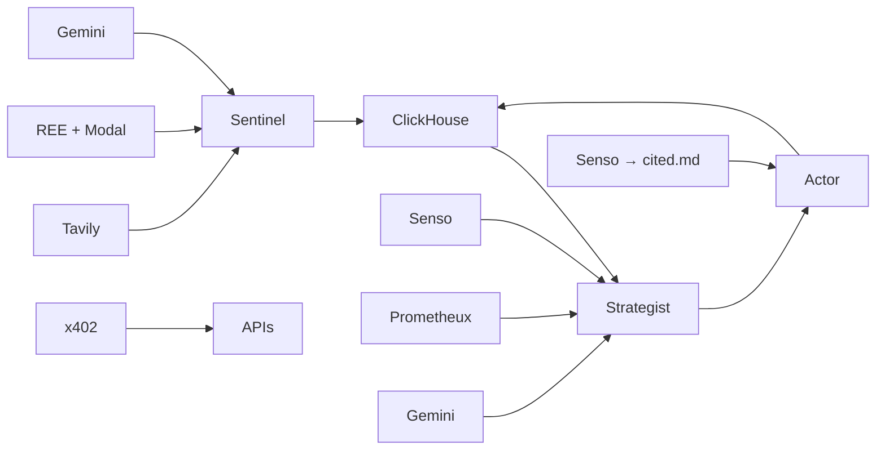

# Sponsor Integrations — How Each Sponsor Is Used

This document maps every hackathon sponsor to its role in the codebase, the agent that calls it, and the offline fallback behavior.

---

## Pipeline at a Glance



**Three agents, one pipeline:**

| Agent | Role | Sponsors used |
|-------|------|---------------|
| **Sentinel** | Ingest & classify competitor signals | Tavily, REE + Modal, Gemini |
| **Strategist** | Reason & draft counter-campaigns | ClickHouse, Senso, Prometheux, Gemini |
| **Actor** | Publish & audit | Senso (cited.md), ClickHouse, x402 |

---

## 1. Tavily — Open-Web Ingestion (Sentinel)

| | |
|---|---|
| **Files** | `src/lib/integrations/tavily.ts`, `config/tavily_profiles.yaml` |
| **Triggered by** | Sentinel sweep (`src/lib/agents/sentinel.ts`) |
| **Env vars** | `TAVILY_API_KEY`, `TAVILY_USE_CACHE` |

**What it does:** Runs tenant-specific search profiles (pricing, launches, mentions, trends, comparisons) against competitor domains defined in `config/tenants/*.yaml`.

**Fallback:** Reads cached snapshots from `data/snapshots/{tenant}/` when `TAVILY_USE_CACHE=true` or no API key is set.

**Scripts:**
- `scripts/cache-tavily-snapshot.ts` — bakes a live sweep to disk for reliable demos

---

## 2. Gensyn REE + Modal — Verifiable Threat Classification (Sentinel)

| | |
|---|---|
| **Files** | `src/lib/integrations/ree.ts`, `src/lib/integrations/classifier.ts`, `services/ree-modal/app.py` |
| **Triggered by** | Sentinel classification pipeline |
| **Env vars** | `REE_SERVICE_URL`, `REE_USE_CACHE`, `REE_MODEL_NAME`, `REE_GPU`, `MODAL_TOKEN_ID`, `MODAL_TOKEN_SECRET` |

**What it does:** Classifies each ingested event (severity, category, summary) and produces a cryptographic REE receipt proving the inference was reproducible.

**Classification chain:**
1. Cached receipts (`data/ree_receipts/`)
2. Live Modal GPU endpoint (`REE_SERVICE_URL`)
3. Gemini (fallback)
4. Local heuristics (last resort)

**Modal sidecar:** Hosts Qwen3-8B on L4/T4 GPUs. Deploy with `modal deploy` from `services/ree-modal/`.

**Dashboard:** Event feed shows a REE badge linking to `/api/dashboard/ree/receipt/{hash}`.

**Scripts:**
- `scripts/bake-ree-receipts.ts` — pre-bakes demo receipts for offline demos

---

## 3. Google DeepMind (Gemini 2.5 Flash) — Classification & Copywriting

| | |
|---|---|
| **Files** | `src/lib/integrations/gemini.ts`, `src/lib/agents/strategist.ts` |
| **Triggered by** | Sentinel (fallback classifier), Strategist (copywriter) |
| **Env vars** | `GEMINI_API_KEY` |

**Two jobs:**

1. **Sentinel fallback classifier** — rates threat severity and category when REE is unavailable
2. **Strategist copywriter** — generates grounded campaign briefs with sections: Trigger, Strategic Brand Stance, Counter-Content Copy Draft, Distribution Channel. Grounded in Senso brand facts and Prometheux strategy angle.

**Fallback:** Rule-based heuristics for classification; pre-written template copy for drafting.

---

## 4. ClickHouse — Event Store & Analytics

| | |
|---|---|
| **Files** | `src/lib/integrations/clickhouse.ts` |
| **Triggered by** | All three agents + dashboard APIs |
| **Env vars** | `CLICKHOUSE_HOST`, `CLICKHOUSE_KEY_ID`, `CLICKHOUSE_KEY_SECRET` |

**What it stores:**
- Competitor events (with REE receipt metadata)
- Published counter-actions (latency, URLs)
- x402 revenue events

**Powers:** Dashboard SSE feed, metrics bar, competitor deep-dives, gated intelligence APIs.

**Fallback:** `data/db_fallback.json` when `CLICKHOUSE_HOST` is unset.

**Scripts:**
- `scripts/setup-clickhouse.ts` — creates tables or verifies fallback state
- `scripts/seed-demo-data.ts` — seeds demo events and briefs

---

## 5. Senso.ai — Brand Knowledge & Publish Channel

Senso is used in **two distinct roles**:

### Role A — Brand Knowledge Base (Strategist)

| | |
|---|---|
| **Files** | `src/lib/integrations/senso.ts` |
| **Triggered by** | Strategist Node 2 |
| **Env vars** | `SENSO_API_KEY` |

Retrieves USPs, positioning, product lines, and brand voice to ground strategy and copy.

**Fallback:** Local `data/senso_kb.json` with keyword similarity search.

**Scripts:** `scripts/seed-senso.ts`

### Role B — cited.md Publisher (Actor)

| | |
|---|---|
| **Files** | `src/lib/integrations/citedmd.ts` |
| **Triggered by** | Actor via `src/lib/integrations/publisher.ts` |
| **Env vars** | `SENSO_API_KEY`, `CITED_MD_GEO_QUESTION_ID`, `CITED_MD_PUBLISHER_SLUG`, `CITED_MD_BASE_URL`, `CITED_MD_INDUSTRY_SLUG` |

Publishes campaign briefs via Senso's `content-engine/publish` API → live public URLs on [cited.md](https://cited.md).

Gymshark tenant config (`config/tenants/gymshark.yaml`) sets `owned_publish_channel.type: citedmd`.

**Fallback:** Mock cited.md URLs when no `SENSO_API_KEY`.

**Scripts:** `scripts/test-citedmd-publish.ts` — smoke-test live publish

---

## 6. Prometheux — Vadalog Strategic Reasoning (Strategist)

| | |
|---|---|
| **Files** | `src/lib/integrations/prometheux.ts` |
| **Triggered by** | Strategist Node 3 |
| **Env vars** | `PROMETHEUX_TOKEN`, `PROMETHEUX_BASE_URL` |

**What it does:** Maps competitor move → counter-strategy angle with explainable rule lineage.

**Four Vadalog rules:**

| Rule | Trigger | Counter-strategy |
|------|---------|------------------|
| Rule 1 | High-severity pricing cut | Value-Driven Multi-Pack Bundle Campaign |
| Rule 2 | Eco/bio launch | Highlight Existing Sustainable Recycled Lines |
| Rule 3 | Flash sale | Affiliate Community Free Delivery & Accessories Hook |
| Rule 4 | Default / other | Community Highlight & Organic Social Push |

**Fallback:** Same rules evaluated locally in JS when the Prometheux REST API is unavailable.

---

## 7. x402 — Micropayment Rail (Monetization)

| | |
|---|---|
| **Files** | `src/lib/integrations/x402.ts` |
| **Triggered by** | Intelligence APIs, campaign strike routes |
| **Env vars** | `X402_FACILITATOR_URL` |

**Two fee tiers:**

| Fee | When | Route |
|-----|------|-------|
| **$0.01** | Intelligence API query | `/api/intelligence/feed`, `/api/intelligence/event/[id]` |
| **$0.49** | Campaign publication | `/api/dashboard/trigger-strike`, `/api/dashboard/trigger-demo` |

Returns HTTP 402 without `x-payment-proof` header. Revenue events logged to ClickHouse and shown in the dashboard Metrics Bar.

---

## 8. Notion — Legacy Publish Channel (Optional)

| | |
|---|---|
| **Files** | `src/lib/integrations/notion.ts`, `src/lib/integrations/publisher.ts` |
| **Triggered by** | Actor (for tenants with `type: notion`) |
| **Env vars** | `NOTION_TOKEN`, `NOTION_DATABASE_ID` |

Publishes structured campaign briefs to a Notion database. Gymshark now defaults to **cited.md**; Notion remains available for other tenants.

**Fallback:** Mock `notion.so` URLs when no `NOTION_TOKEN`.

---

## Not a Sponsor Integration

| Name | Notes |
|------|-------|
| **Tessl** | Hackathon / repo name only — no Tessl SDK or API in the codebase |
| **cited.md (platform)** | Publish destination delivered through Senso's content-engine API |
| **Local `cited.md` file** | Root audit log appended by Actor for provenance tracing — separate from live cited.md publishing |

---

## Offline Demo Mode

Every sponsor has a fallback. The platform runs with **zero API keys**:

| Sponsor | Offline behavior |
|---------|------------------|
| Tavily | Cached snapshots in `data/snapshots/` |
| REE + Modal | Pre-baked receipts in `data/ree_receipts/` |
| Gemini | Heuristics + template copy |
| ClickHouse | `data/db_fallback.json` |
| Senso | Local KB + mock publish URLs |
| Prometheux | Local Vadalog JS engine |
| x402 | Simulated payment proof |
| Notion | Mock page URLs |

Validate everything with:

```bash
npx tsx scripts/run-tests.ts
```

---

## Credentials Policy

All sponsor API keys live in server-side `.env` only — accessed in `src/lib/integrations/` and `src/app/api/`. **No API key fields in the dashboard UI.** Tenant switching is config-driven (`ACTIVE_TENANT=gymshark`), not user-supplied keys.

See also: [AGENTS.md](./AGENTS.md) for agent prompts and coordination, [PLAN.md](./PLAN.md) for architecture, [demo_guide.md](./demo_guide.md) for presentation script.
